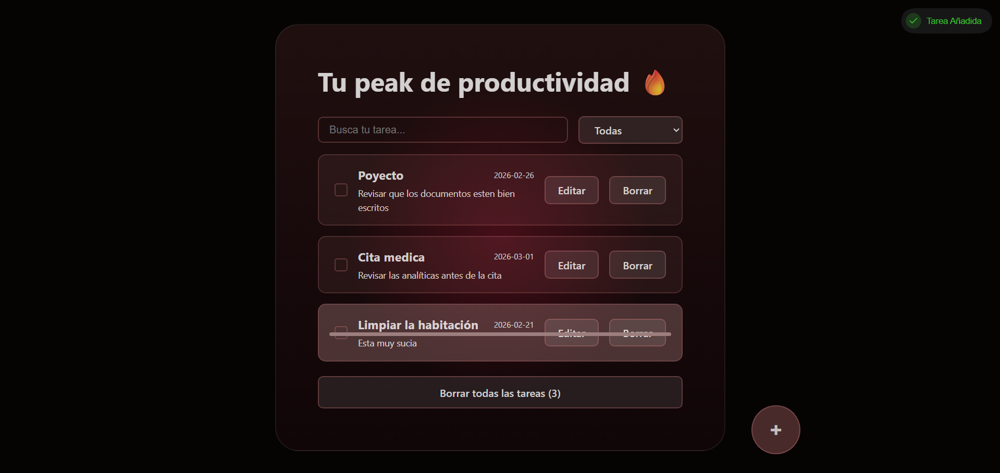

# ✅ Peak Productivity — To-Do List App

Una aplicación de gestión de tareas construida con React como proyecto de aprendizaje. Interfaz limpia, CSS propio y responsive.


> *Captura de la todo list en funcionamiento*

---

## 🚀 Tecnologías

- **React** + **Vite** — estructura y bundling
- **Sileo** — notificaciones Toast animadas
- **CSS vanilla** — estilos 100% propios, sin librerías UI, completamente responsive

---

## ✨ Funcionalidades

- ➕ Añadir tareas con nombre, fecha límite y descripción opcional
- ✔️ Marcar tareas como completadas
- 🗑️ Borrar tareas individuales o todas a la vez
- 🔍 Buscador en tiempo real por nombre
- 🔽 Filtrado por estado: todas, completadas o pendientes
- 📅 Validación de formulario
- 🔔 Feedback visual con toasts animados en cada acción

---

## 📦 Instalación

```bash
git clone https://github.com/tu-usuario/tu-repo.git
cd tu-repo
npm install
npm run dev
```

---

## 🗂️ Estructura

```
src/
├── App.jsx         # Componente principal y lógica de estado
├── App.css         # Estilos globales responsive
└── assets/         # Imágenes y recursos estáticos
```

---

## 🧠 Aprendizajes clave

Este proyecto fue construido para practicar:
- Gestión de estado con `useState`
- Comunicación entre componentes padre e hijo via props
- Validación de formularios en React
- Filtrado y búsqueda de listas dinámicas

---
